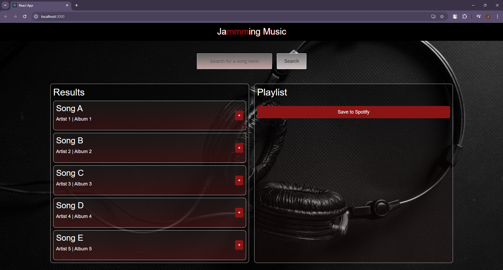

# Preview

# Jamming Music

Jamming Music is a music playlist application that allows users to search for songs, add them to their playlist, and save the playlist to Spotify. It’s built with React and is designed to provide a seamless and interactive experience for music lovers.

## Features

- **Search for Songs**: Users can search for songs by title, artist, or album.
- **Create Playlist**: Users can add songs to a personal playlist.
- **Remove Songs**: Users can remove songs from their playlist.
- **Save to Spotify**: A mock save feature to simulate saving the playlist to Spotify.

## Technologies Used

- **React**: Front-end JavaScript library for building user interfaces.
- **Bootstrap**: Used for styling the app with responsive layouts.
- **CSS**: Custom styling for components.
